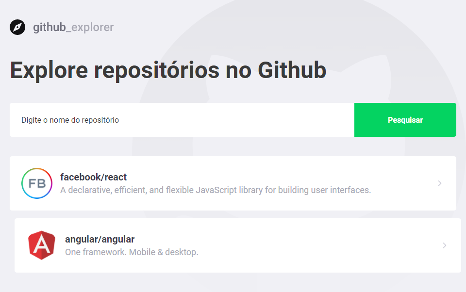

# Github Explorer
> Simple consumption design of the github api.

[![NPM Version][npm-image]][npm-url]
[![Build Status][travis-image]][travis-url]
[![Downloads Stats][npm-downloads]][npm-url]

Project that performs searches of repositories and visualizes their information.



## Development setup

### Prerequisites

* yarn or npm

> Using yarn 

```sh
yarn
yarn start
```
> Using npm

```sh
npm install
npm start
```

## Meta

Eder Neves de Oliveira – ederneves_oliveira@hotmail.com

[https://github.com/DevEderNO](https://github.com/DevEderNO)

## Contributing

1. Fork it (<https://github.com/DevEderNO/github-explorer/fork>)
2. Create your feature branch (`git checkout -b feature/fooBar`)
3. Commit your changes (`git commit -am 'Add some fooBar'`)
4. Push to the branch (`git push origin feature/fooBar`)
5. Create a new Pull Request

<!-- Markdown link & img dfn's -->
[npm-image]: https://img.shields.io/npm/v/datadog-metrics.svg?style=flat-square
[npm-url]: https://npmjs.org/package/datadog-metrics
[npm-downloads]: https://img.shields.io/npm/dm/datadog-metrics.svg?style=flat-square
[travis-image]: https://img.shields.io/travis/dbader/node-datadog-metrics/master.svg?style=flat-square
[travis-url]: https://travis-ci.org/dbader/node-datadog-metrics
[wiki]: https://github.com/yourname/yourproject/wiki
